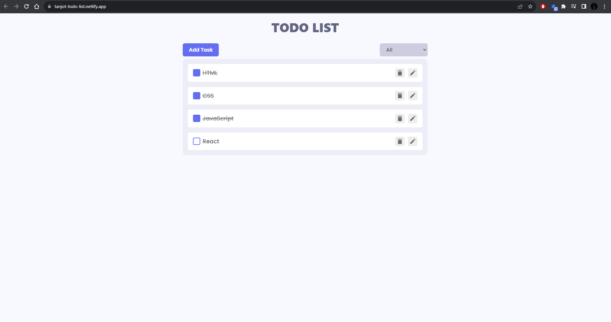

<h1>React Todo App</h1>

## Description

This is a simple Todo App built using React. It allows you to add, remove, edit, and mark tasks as complete. You can also filter tasks to view all tasks, incomplete tasks, or completed tasks. The app features smooth transitions using React.

You can access the live demo of this app here: [Todo App Demo](https://tanjot-todo-list.netlify.app/)

## Features

- Add tasks to your todo list.
- Remove tasks from your todo list.
- Edit existing tasks.
- Mark tasks as complete.
- Filter tasks to view all, incomplete, or complete tasks.
- Smooth transitions using React.
